# *BookEat* - Sprint 2
**Subgrupo 42.2:** José Marcial Galván, Alejandra Rodríguez, Cristina Santana

> ***BookEat*** es una solución web ideada para el sector de la restauración, con el fin de facilitar una conexión fluida
> y eficiente entre comensales y establecimientos. Para lograrlo, el proyecto se apoya en tres ejes funcionales:
> - **Descubrimiento y Búsqueda**: Consulta detallada de perfiles de restaurantes con filtros avanzados para encontrar el lugar ideal.
> - **Gestión Inteligente de Reservas**: Control de disponibilidad de mesas en tiempo real y confirmaciones online, eliminando las esperas telefónicas.
> - **Interacción mediante Reseñas**: Sistema de reseñas que garantiza la transparencia y ayuda a mejorar la calidad del servicio.
>
> En definitiva, BookEat unifica en una sola interfaz intuitiva todas las herramientas necesarias para que el cliente disfrute de su reserva y el restaurante optimice su flujo diario de trabajo.
>
> _Para conocer más sobre el proyecto, consulta la [documentación del sprint 1](doc/sprint-1/README.md)_

En este segundo _sprint_, **BookEat** ha dejado de ser una interfaz estática para convertirse en una aplicación web funcional impulsada por datos. El foco principal ha sido la creación de un **flujo de reserva inteligente** que conecta la disponibilidad real de los restaurantes con la selección precisa de mesas por parte del usuario, todo bajo una arquitectura de componentes reutilizables.

---

## Infraestructura y Carga Dinámica de Datos

En este _sprint_, la web pasa a cargar dinámicamente los datos. De esta forma, por ejemplo, las tarjetas de los restaurantes, 
usuarios o reseñas quedan pobladas con información traída de ficheros JSON.

### Base de Datos y Persistencia
La estructura de los ficheros JSON implementados simula la estructura de una base de datos. En ella se gestionan las siguientes entidades
(haga clic en el nombre para acceder al fichero JSON asociado):

| Nombre de Fichero                                                      |                                   Estructura                                   | Descripción                                                                                     |
|:-----------------------------------------------------------------------|:------------------------------------------------------------------------------:|:------------------------------------------------------------------------------------------------|
| [**restaurants.json**](data/entities/restaurants.json)                 |         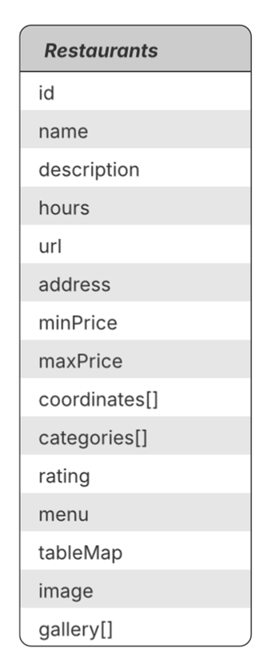         | Información detallada, horarios, coordenadas y menús.                                           |
| [**categories.json**](data/entities/categories.json)                   |          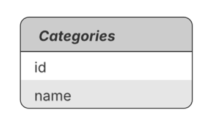          | Categorías (tipo de comida) para los restaurantes.                                              |
| [**bookings.json**](data/entities/bookings.json)                       |            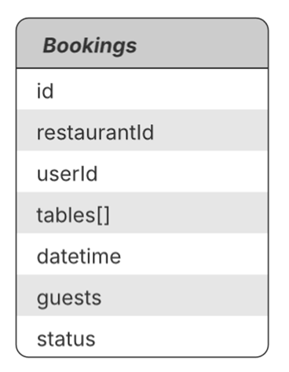            | Registro de reservas, que vinculan usuarios con mesas específicas en fechas y horas concretas.  |
| [**reviews.json**](data/entities/reviews.json)                         |             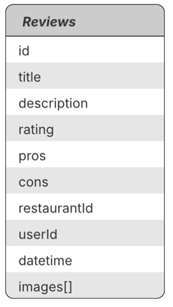             | Registro de reseñas realizadas por usuarios a restaurantes.                                     |
| [**users.json**](data/entities/users.json)                             |               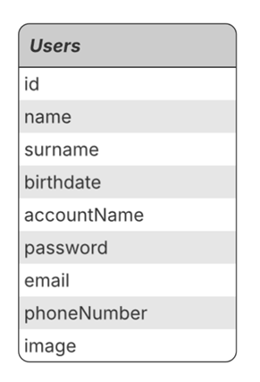               | Gestión de perfiles y credenciales para el sistema de login de usuarios registrados (clásicos). |
| [**restaurant-profiles.json**](data/entities/restaurant-profiles.json) | 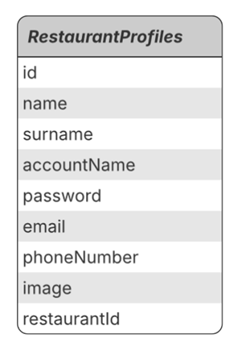 | Gestión de perfiles de usuarios restaurantes. Vinculados a un restaurante por `restaurantId`.   |

### Inyección de Datos y Filtros
Una vez creados los ficheros de datos, los elementos se deben rellenar correctamente con ellos. Para ello, se crean una 
serie de funciones que permiten inyectar la información de forma modular y precisa. La más importante de ellas
es [`injectData()`](src/js/load-data.js#L90-L101).
  
Cualquier elemento que necesite una inyección de datos debe indicar el atributo `data-template`, y un valor con la estructura
`tipo-clave`. Por ejemplo, si indicamos `

`, en este párrafo se inyectará un _texto_, que se
encuentre en un fichero JSON bajo la clave _name_. Opcionalmente, si se desea realizar un tratamiento adicional a los datos traídos
del fichero, se puede añadir el atributo `filter`. Entonces, si modificamos nuestro párrafo anterior para convertirlo en
`

`, se aplicará la función _uppercase_ al nombre encontrado.
* Los tipos posibles de datos a inyectar se encuentran en la constante [`typeActions`](src/js/load-data.js#L6-L17). Cada tipo se mapea a una función, que al ejecutar inyecta el dato en el elemento.
* Los tipos posibles de filtros a aplicar se encuentran en la constante [`filters`](src/js/filters.js#L4-L11). Cada filtro se mapea a una función, que al ejecutarla aplica una conversión específica a los datos pasados.

### Inyección según el Tipo de Dato
Se diferencian 2 cargas distintas de datos a realizar, cada una utilizando una función distinta:
- ***Fill Template***: En caso de que los datos traídos se encuentren en *forma de array*, se deberá crear una instancia de _template_ distinta por cada uno de los objetos del array. Esto es posible gracias a la función [`fillTemplate()`](src/js/load-data.js#L49-L72).
- ***Fill Component***: En caso de que los datos traídos se encuentren en *forma de objeto*, únicamente se deberá rellenar el elemento con los distintos atributos del elemento. Esta lógica se implementa en la función [`fillComponent()`](src/js/load-data.js#L20-L46), poblando con datos un elemento y todos sus sub-elementos.

---

## Validación de Formularios

Para garantizar que los datos introducidos en el sistema sean correctos, hemos implementado en todos los formularios una doble capa de validación:

1. **Atributos HTML5**: Utilizamos validación nativa del navegador mediante atributos como `required` o `type="email"`. Esto proporciona una primera barrera rápida y accesible directamente desde HTML.
2. **Comprobaciones Extra con JavaScript**:
   - Se anula el envío del formulario por defecto al hacer clic en el botón submit (`preventDefault()`), para validar la coherencia de los datos antes del envío al servidor (por ejemplo, que la contraseña indicada y su repetición coincidan).
   - Retroalimentación: Al detectar errores en la cumplimentación de formularios, el sistema proporciona _feedback_ visual al usuario, indicando el motivo del error. De esta forma, los fallos pueden ser corregidos rápidamente por los usuarios.

Ejemplos de comprobaciones en los formularios del sitio:

| Login                                                                                                        | Create an Account                                                   | Become an affiliate                                                         |
|:-------------------------------------------------------------------------------------------------------------|:--------------------------------------------------------------------|:----------------------------------------------------------------------------|
| 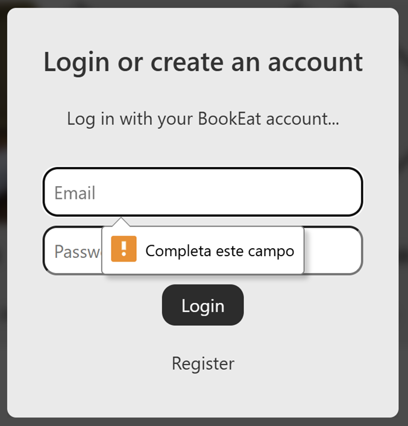 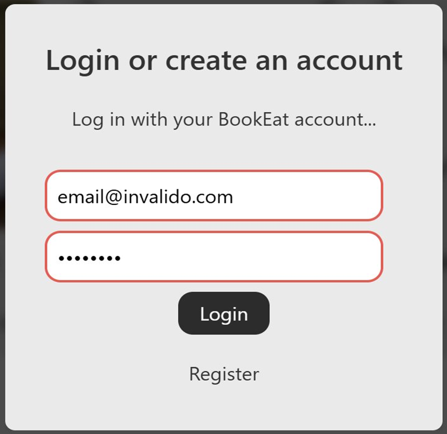 | 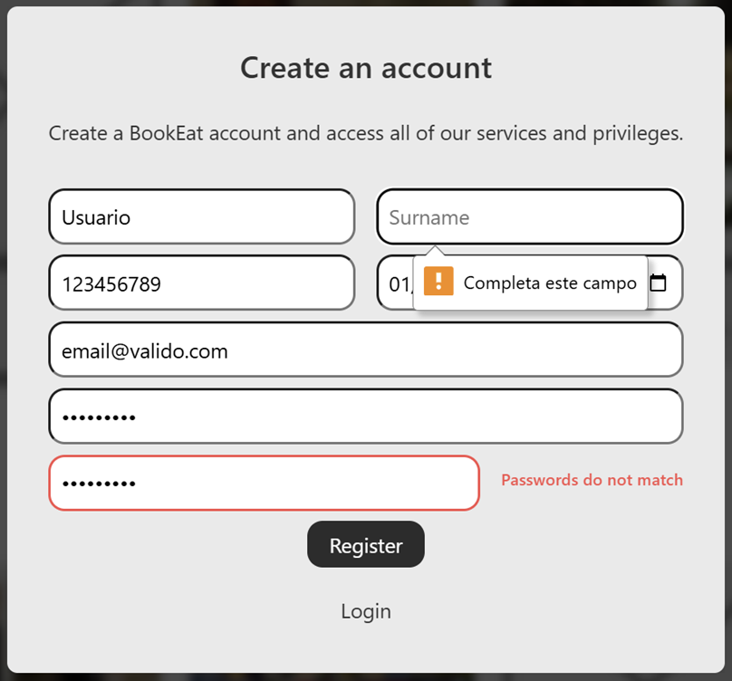 | 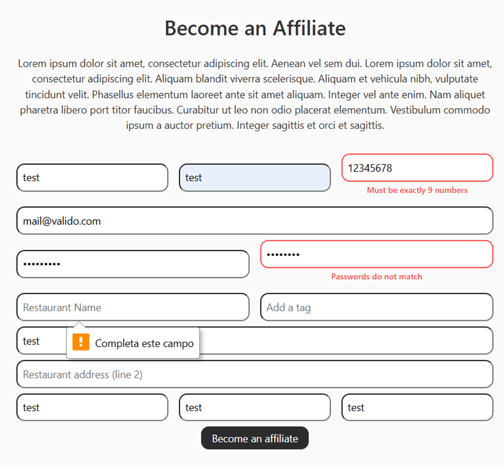 |

---

## Diseño Adaptativo

En este sprint, la prioridad ha sido la adaptación a todo tipo de dispositivos. Nuestra estrategia partió de un diseño **Desktop-First**, pues la estructura ya estaba consolidada, y desde ahí escalamos hacia abajo a **Tablet** y **Móvil**. Para ello, se rediseñaron los _mockups_ incluyendo estas dos nuevas versiones:

| Móvil                                                                                                                                                                                                                                                                                          | Tablet                                                                                                                                                                                                                                                                                            | Desktop                                                                                                                                                                                                                                                                                           |
|:-----------------------------------------------------------------------------------------------------------------------------------------------------------------------------------------------------------------------------------------------------------------------------------------------|:--------------------------------------------------------------------------------------------------------------------------------------------------------------------------------------------------------------------------------------------------------------------------------------------------|:--------------------------------------------------------------------------------------------------------------------------------------------------------------------------------------------------------------------------------------------------------------------------------------------------|
| 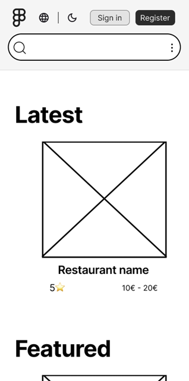                                                                                                                                                                                                                                          | 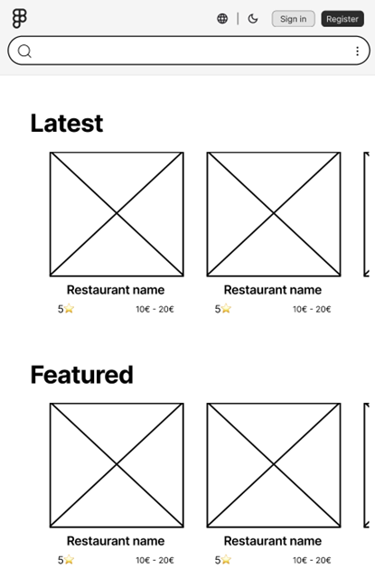                                                                                                                                                                                                                                            | 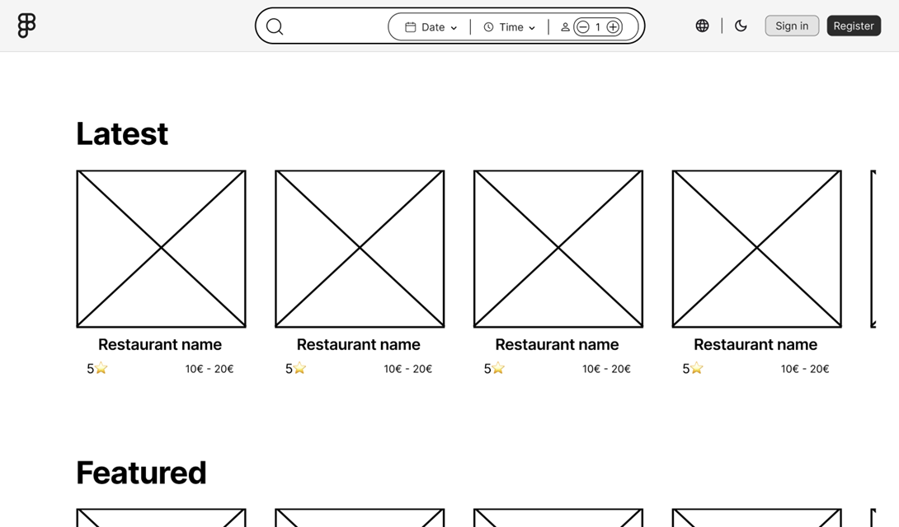                                                                                                                                                                                                                                           |
| *[Acceder al Prototipo Interactivo en Figma ↑](https://www.figma.com/proto/Ele6klzfFfdvQzFIwlkU7Q/Trabajo-de-PWM?page-id=1047%3A9684&node-id=1047-10347&viewport=780%2C-91%2C0.27&t=uZHnr3rhFp4Wr4pL-1&scaling=min-zoom&content-scaling=fixed&starting-point-node-id=1047%3A10347)* | *[Acceder al Prototipo Interactivo en Figma ↑](https://www.figma.com/proto/Ele6klzfFfdvQzFIwlkU7Q/Trabajo-de-PWM?page-id=986%3A3406&node-id=1000-6543&p=f&viewport=5062%2C1242%2C1.06&t=tn3L8w3h7qjQVibZ-1&scaling=min-zoom&content-scaling=fixed&starting-point-node-id=1000%3A6543)* | *[Acceder al Prototipo Interactivo en Figma ↑](https://www.figma.com/proto/Ele6klzfFfdvQzFIwlkU7Q/Trabajo-de-PWM?page-id=986%3A3406&node-id=1000-6543&p=f&viewport=5062%2C1242%2C1.06&t=tn3L8w3h7qjQVibZ-1&scaling=min-zoom&content-scaling=fixed&starting-point-node-id=1000%3A6543)* |

En cuanto a la adaptación del sitio web, la mayoría de nuestros templates ya utilizaban anchos porcentuales (con `width: n%`, en base al elemento padre), por lo que las mejoras se centraron en la **reubicación estratégica de la información** mediante **Bootstrap 5** y **Media Queries de CSS3** personalizadas para la necesidad de cada template.
  
Las mejoras principales en este ámbito incluyen:

### Landing Page
- **Header**: Se adaptó la barra de búsqueda. En dispositivos estrechos, se ubica en una segunda fila y se sustituye por un **botón hamburguesa** que despliega el selector de comensales, fecha y hora de forma cómoda.
- **Footer**: Las secciones pasan de una distribución horizontal a una **columna única**, agrupando los links y contactos en menús desplegables para ahorrar espacio vertical.

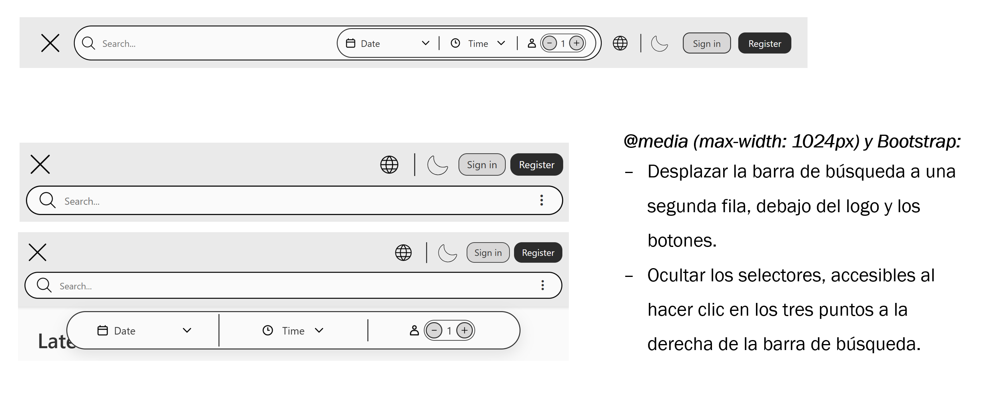
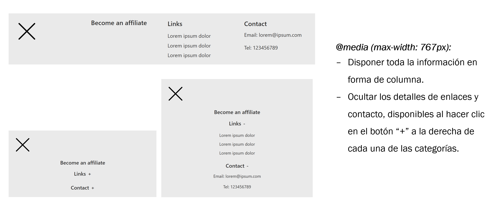

### Página de Búsqueda (Searcher)
- **Filtros**: Pasan de estar en el lateral izquierdo a ubicarse justo debajo del header, optimizando el ancho de pantalla.
- **Overview Template**: Se visualiza toda la información de las tarjetas en vertical, como columna.

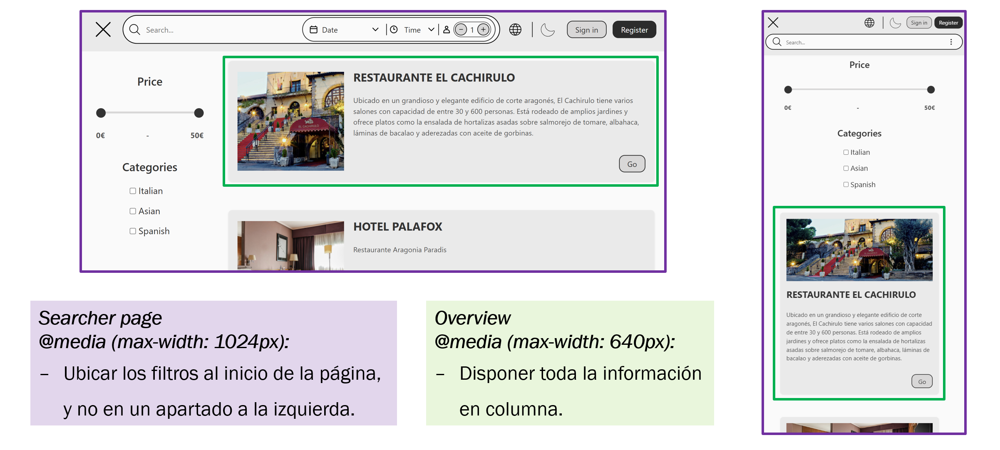

### Restaurant Info y Reviews
- **Restaurant Info**: La información se dispone en forma de columna, y el menú del restaurante pasa de dos columnas a una sola fila por plato.
- **Rating Breakdown**: El desglose de puntuaciones se adapta de dos columnas a una para mantener la legibilidad de las barras de progreso.

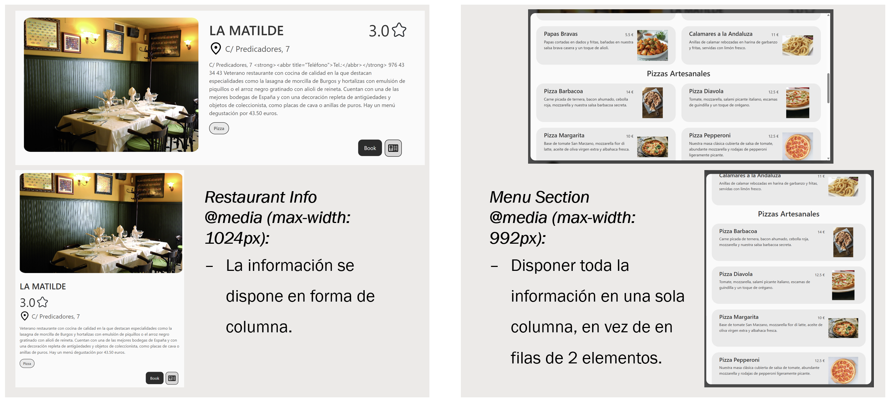
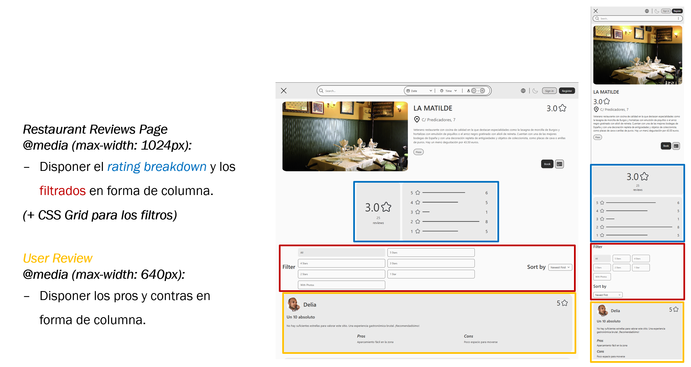

### Proceso de Reserva (Booking Details & Table Page)
- **Booking Details**: Los campos de selección (Diners, Date, Time) se reorganizan según el espacio disponible, pasando de todas en una fila (desktop) a todas en una columna (móvil).
- **Mapa Interactivo**: En la página de selección de mesa, hemos ubicado el mapa sobre un cuadro escalable, permitiendo que desde cualquier dispositivo (incluyendo pantallas pequeñas) se pueda seleccionar una mesa concreta con precisión.
- **Confirmación de reserva**: Este popup (al igual que otros como Write Review Popup) se dispone en forma de columna.

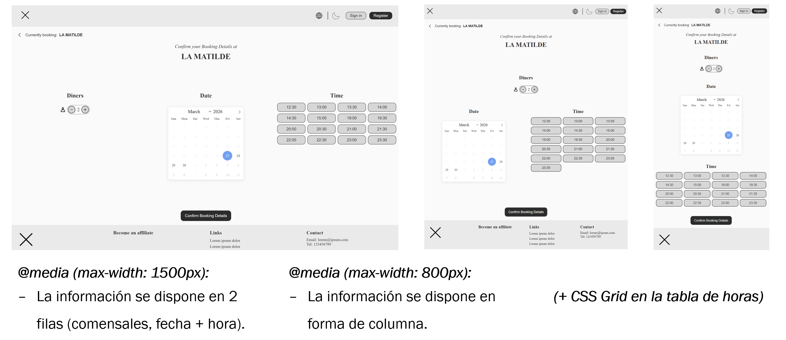
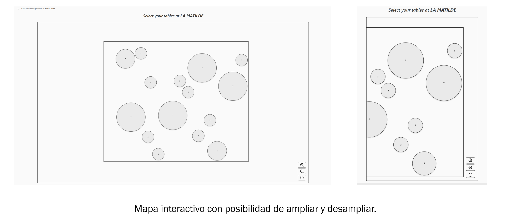
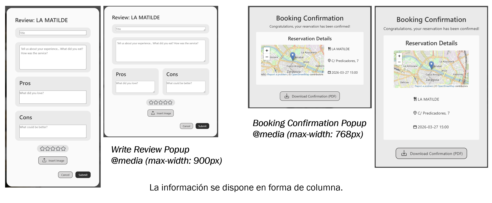

## Tech Stack - Otros
- Se debe usar `npm install` para instalar las dependencias de la aplicación (_Bootstrap_, _FlatPickr_, _JsonServer_, _Panzoom_ y _Proj4_).
- Tras instalar las dependencias, ejecutar `npm run api` para lanzar el _JsonServer_ (_localhost en puerto 3000_), y abrir el sitio web.

 

    

        
        
        
        
        
        
        
        
   

 

- Todos los iconos han sido descargados de [SVGRepo](https://www.svgrepo.com/).
