# *BookEat* - Sprint 3
**Subgrupo 42.2:** José Marcial Galván, Alejandra Rodríguez, Cristina Santana

> [!NOTE] 
> ***BookEat*** es una solución web ideada para el sector de la restauración, con el fin de facilitar una conexión fluida
> y eficiente entre comensales y establecimientos. Para lograrlo, el proyecto se apoya en tres ejes funcionales:
> - **Descubrimiento y Búsqueda**: Consulta detallada de perfiles de restaurantes con filtros avanzados para encontrar el lugar ideal.
> - **Gestión Inteligente de Reservas**: Control de disponibilidad de mesas en tiempo real y confirmaciones online, eliminando las esperas telefónicas.
> - **Interacción mediante Reseñas**: Sistema de reseñas que garantiza la transparencia y ayuda a mejorar la calidad del servicio.
>
> En definitiva, BookEat unifica en una sola interfaz intuitiva todas las herramientas necesarias para que el cliente disfrute de su reserva y el restaurante optimice su flujo diario de trabajo.
>
> _Para conocer más sobre el proyecto, consulta la [documentación del sprint 1](doc/sprint-1/README.md) y la [documentación del sprint 2](doc/sprint-2/README.md)_

En este tercer _sprint_, **BookEat** ha sido reimplementada para utilizar tecnologías más profesionales. Concretamente,
se ha migrado la aplicación a **Angular** en el _frontend_, y a **Firebase** en el _backend_.

---

## Estructura del proyecto

```
bookeat/src/
├── app/
│   ├── components/
│   ├── models/
│   ├── pages/              # Componentes "rutables" de la aplicación
│   ├── pipes/              # Transformaciones de datos reutilizables 
│   ├── services/           # Punto de acceso a los datos...
│   │   ├── firebase/           # en Firebase
│   │   ├── jsonserver/         # en JSON Server
│   │   └── ...
│   ├── validators/         # Validaciones de datos personalizadas
│   ├── app.config.ts       # Configuraciones de la aplicación
│   ├── app.routes.ts       # Endpoints, rutas a las páginas de la web
│   └── ...  
├── environments/           # Variables de entorno (clave de acceso a Firebase)
└── ...
```

---

---

## Estructura de los componentes

```
bookeat/src/
├── app/
│   ├── componnets/
│   │   ├── affiliate-form/    # Crear un usuario restaurante
│   │   ├── booking-confirmation/    # Información de una reserva completada
│   │   ├── create-an-account/    # Crear una cuenta de cliente
│   │   ├── date-range/    # Seleccionar un rango de fechas (inicio y fin)
│   │   ├── date-selector/    # Seleccionar un día específico para la reserva
│   │   ├── dinner-selector/    # Seleccionar el número de comensales
│   │   ├── edit-button/    # Botón genérico para activar la edición de un elemento
│   │   ├── edit-profile-image-popup/    # Ventana emergente para cambiar la foto de perfil
│   │   ├── edit-profile/    # Formulario para actualizar los datos personales
│   │   ├── footer/    # Pie de página de la aplicación
│   │   ├── form-card/    # Contenedor con estilos predefinidos para envolver formularios
│   │   ├── header/    # Cabecera principal con navegación y logo
│   │   ├── hour-selector/    # Desplegable o lista para elegir la hora de la reserva
│   │   ├── hour-table/    # Cuadrícula visual que muestra la disponibilidad por horas
│   │   ├── insert-image/    # Componente para cargar o subir archivos de imagen
│   │   ├── login-popup/    # Ventana emergente para iniciar sesión
│   │   ├── menu-item/    # Tarjeta individual con la información de un plato
│   │   ├── menu-popup/    # Ventana emergente con los detalles extendidos de un plato o carta
│   │   ├── menu-section/    # Categoría que agrupa varios menu-item
│   │   ├── my-account/    # Panel principal de configuración e información del usuario
│   │   ├── overview/    # Componente genérico que muestra datos de restaurantes/usuarios
│   │   ├── price-label/    # Etiqueta visual para indicar precio o rango de precios
│   │   ├── rating-breakdown/    # Gráfico que desglosa las distintas puntuaciones recibidas
│   │   ├── restaruant-carousel/    # Carrusel deslizable de tarjetas de restaurantes
│   │   ├── restaruant-info/    # Detalles generales de un restaurante (dirección, contacto)
│   │   ├── restaurant-item/    # Tarjeta de vista previa de un restaurante en listas
│   │   ├── star-selector/    # Selector interactivo de estrellas para puntuar
│   │   ├── table-map/    # Representación gráfica o plano de las mesas del local
│   │   ├── toast/    # Notificación breve y emergente para avisos del sistema
│   │   ├── user-review/    # Comentario y valoración individual dejada por un cliente
│   │   ├── user-score/    # Puntuación global del restaurante o del usuario
│   │   ├── write-review-popup/    # Ventana emergente con el formulario para escribir una reseña
│   └── ...
└── ...  

```

---

## Migración a Angular

En esta primera parte del _sprint_, se ha adaptado la web implementada en _sprints_ anteriores usando **Angular** como
_framework_ para desarrollo web.

### Servicios
La interacción entre componentes de Angular y el backend se ha realizado, siguiendo las buenas prácticas de Angular, a
través de modelos y servicios.
<br>
Los modelos, ubicados en la carpeta [`models/`](bookeat/src/app/models), componen una interfaz común sobre la que interactúan
tanto servicios como componentes. En estos, se definen las entidades utilizadas por la aplicación así como los campos que
contienen.
<br>
Los modelos son utilizados por los servicios, ubicados en la carpeta [`services/`](bookeat/src/app/services). De esta forma,
los servicios pueden gestionar la lógica de acceso a los datos de forma centralizada, y siguiendo la interfaz definida por los
modelos.
<br>
A continuación, se incluyen los servicios implementados así como los modelos asociados (haga clic en el nombre de un fichero para
acceder a su definición):

|                                 Servicio                                 |                                              Modelo                                              | Descripción                                                                                                                                                                                           |
|:------------------------------------------------------------------------:|:------------------------------------------------------------------------------------------------:|:------------------------------------------------------------------------------------------------------------------------------------------------------------------------------------------------------|
|    [Autenticación](bookeat/src/app/services/firebase/auth.service.ts)    | [Usuario](bookeat/src/app/models/users.model.ts), [Login](bookeat/src/app/models/login.model.ts) | Autenticación con Firebase Auth: inicio de sesión con email/contraseña y Google, registro de nuevos usuarios, cierre de sesión y resolución de la sesión activa según el rol (usuario o restaurante). |
| [Restaurantes](bookeat/src/app/services/firebase/restaurants.service.ts) |                    [Restaurante](bookeat/src/app/models/restaurant.model.ts)                     | Consulta del listado completo de restaurantes, obtención por identificador y actualización parcial de datos (nombre y descripción) en Firestore.                                                      |
|  [Categorías](bookeat/src/app/services/firebase/categories.service.ts)   |                      [Categoría](bookeat/src/app/models/category.model.ts)                       | Carga y creación de categorías de restaurantes desde Firestore. Expone las categorías como _signal_ para su uso en filtros y formularios.                                                             |
|      [Usuarios](bookeat/src/app/services/firebase/users.service.ts)      |                         [Usuario](bookeat/src/app/models/users.model.ts)                         | Consulta y actualización de perfiles de usuario y restaurante en Firestore, tanto del listado completo como de un usuario concreto por identificador.                                                 |
|     [Reseñas](bookeat/src/app/services/firebase/reviews.service.ts)      |                         [Reseña](bookeat/src/app/models/review.model.ts)                         | Obtención de reseñas asociadas a un restaurante y publicación de nuevas reseñas, actualizando además la puntuación del restaurante.                                                                   |
|    [Reservas](bookeat/src/app/services/firebase/bookings.service.ts)     |                        [Reserva](bookeat/src/app/models/booking.model.ts)                        | Gestión de reservas: consulta filtrada por usuario o restaurante, expansión de datos relacionados (restaurante o cliente), creación de nuevas reservas y consulta por restaurante y fecha/hora.       |
|          [Sesión](bookeat/src/app/services/session.service.ts)           |                        [Sesión](bookeat/src/app/models/session.model.ts)                         | Gestión local del estado de la sesión de reserva en curso (fecha, hora y número de comensales) mediante señales de Angular, sin persistencia en el backend.                                           |


### Formularios Nativos

Los formularios de esta página han sido desarrollados gracias a las herramientas nativas proporcionadas por Angular.
Concretamente, se han utilizado formularios reactivos (_Reactive Forms_) para definir los campos del formulario.
Además, se han utilizado _Validators_, tanto nativos de Angular (como Validators.required) como personalizados, para
verificar que el formato de los datos es el correcto.

| 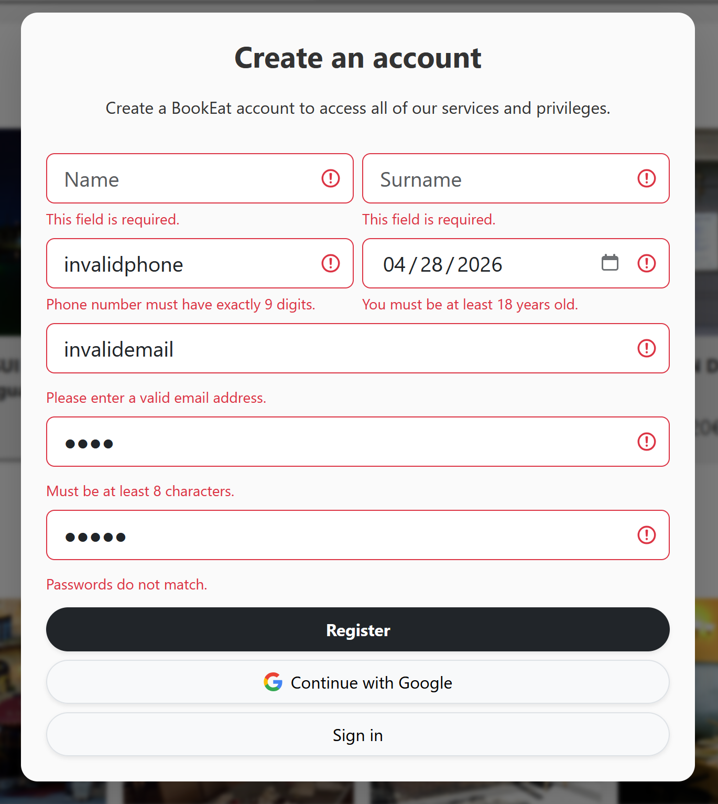 |
|-------------------------------------------------------|
| Ejemplo de validación nativa de Angular               |

### Integración con Bootstrap

Para simplificar la aplicación de estilos a los componentes de la web, se han utilizado clases e iconos de Bootstrap. De
esta forma, se han reducido considerablemente los ficheros CSS. Se han mantenido únicamente las directivas específicas de
esta aplicación, como pueden ser las variables de los distintos colores utilizados.
<br>
También se ha mantenido (y reducido) el fichero genérico styles.css, pues sigue permitiendo una simplificación de los estilos
individuales de cada componente.

---

## Backend con Firebase

Tras migrar el frontend a Angular, la siguiente etapa de este _sprint_ ha consistido en modificar los servicios, ya implementados
con JSON Server, para pasar a utilizar Firebase.

Para ello, en primer lugar se definió el proyecto de Firebase _bookeat-pwm_ gracias a la herramienta de angular
`ng add @angular/fire`. Se añadió Firestore y Storage al proyecto, y se almacenaron las claves del proyecto creado en el
directorio [`environments/`](bookeat/src/environments). Una vez inicializado el proyecto, se ha procedido con la reimplementación
de los servicios utilizando Firebase. Para ello se han tenido en cuenta una serie de elementos, como la autenticación de
usuarios, la subida de imágenes o la propia carga de datos desde esta plataforma.

### Gestión de Usuarios

La gestión y autenticación de usuarios se ha realizado con las herramientas propias de Firebase. Para ello, en primer 
lugar se ha configurado la autenticación desde la consola de Firebase, activando la _Firebase Authentication_. También
se ha habilitado el inicio de sesión con Google, pues Firebase permite su configuración automática.
<br>
Una vez configurada la autenticación desde Firebase, se pueden utilizar las funciones de `@angular/fire` para permitir
el inicio de sesión a los usuarios de la aplicación. 

|  | 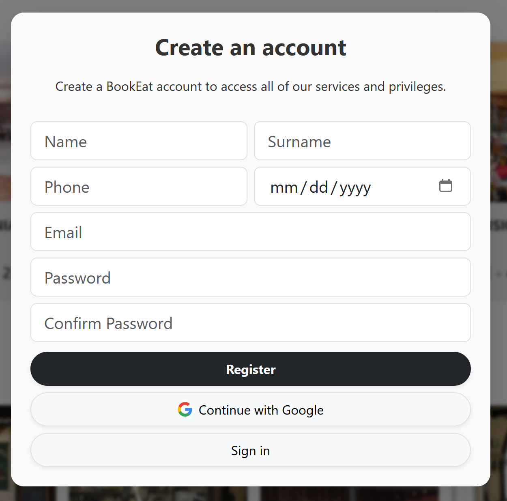 |
|-----------------------------------------|--------------------------------------------------------------|
| Autenticación en _Login_                | Autenticación en _Create an Account_                         |

### Carga de Datos desde Firebase

Los datos, anteriormente obtenidos mediante solicitudes a un JSON Server, ahora están almacenados en la base de datos
de Firebase, **Firestore**. Es por ello que en este sprint se han modificado los servicios (punto de acceso a los
datos) para utilizar colecciones y documentos, de acuerdo con las especificaciones de la nueva base de datos en Firebase.
<br></br>
Las colecciones implementadas coinciden con las entidades definidas en el sprint anterior:

|        **Colección**        |                          **JSON Server**                           |                                 **Firebase**                                 |
|:---------------------------:|:------------------------------------------------------------------:|:----------------------------------------------------------------------------:|
|        **Reservas**         |             |      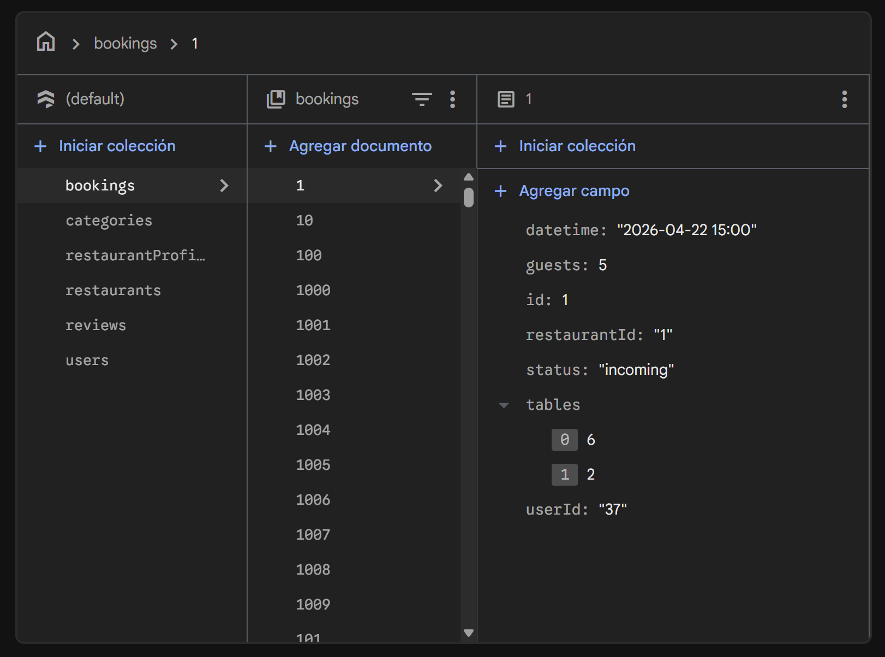       |
|       **Categorías**        |           |     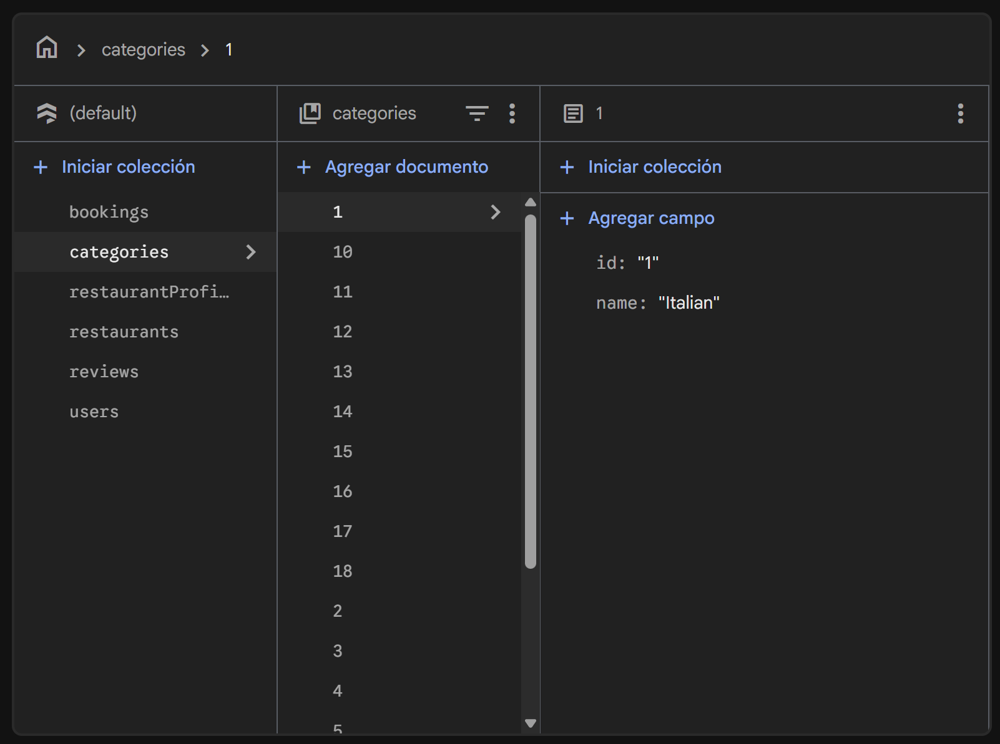      |
| **Perfiles de restaurante** |  | 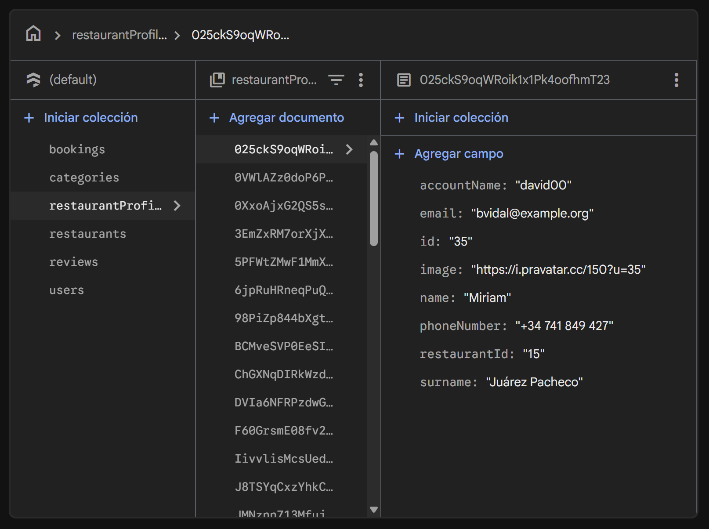 |
|      **Restaurantes**       |          |     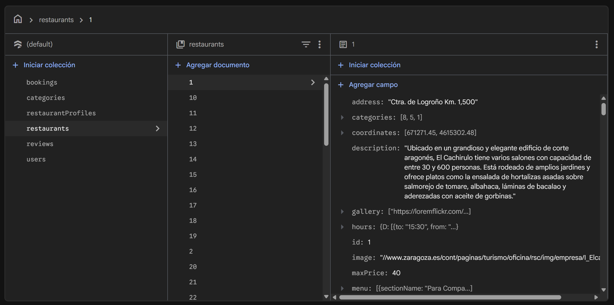     |
|         **Reseñas**         |              |       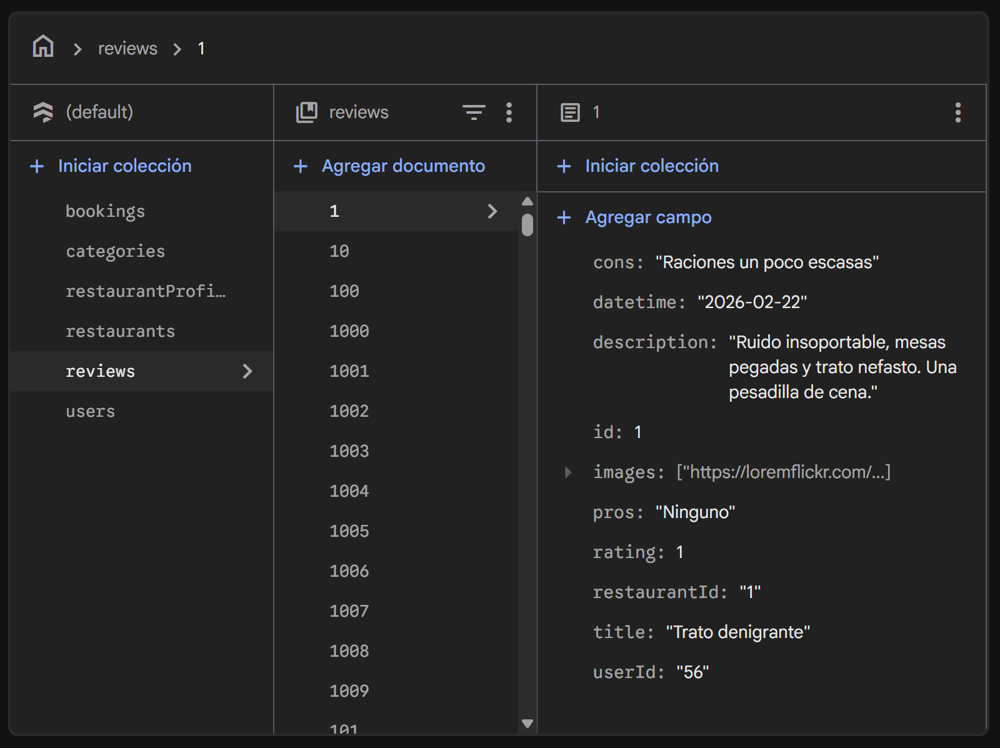       |
|        **Usuarios**         |                |        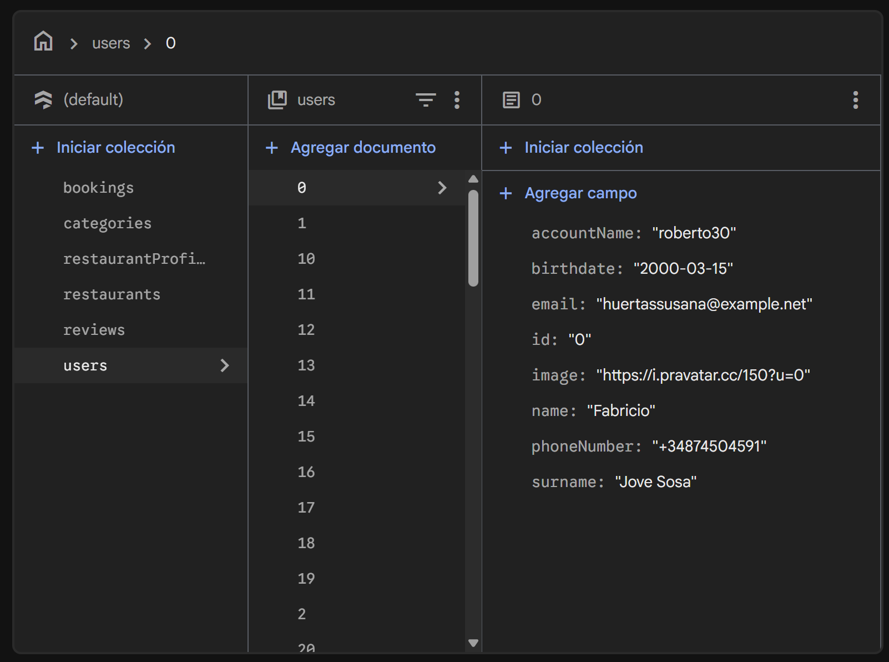        |

### Subida de Imágenes

En la aplicación se permite la subida de ficheros (en este caso imágenes) para, por ejemplo, acompañar a una reseña o
cambiar la foto de perfil. Esto se ha realizado de forma eficiente, almacenando en Firestore el enlace a las imágenes,
y recuperándolas en un segundo _fetch_ en caso de ser necesarias.

| Componente                  | Subida de imágenes en _Edit Profile Image Popup_                        | Subida de imágenes en _Write a Review_                        |
|-----------------------------|-------------------------------------------------------------------------|---------------------------------------------------------------|
| **Inserción de imágenes**   |       | 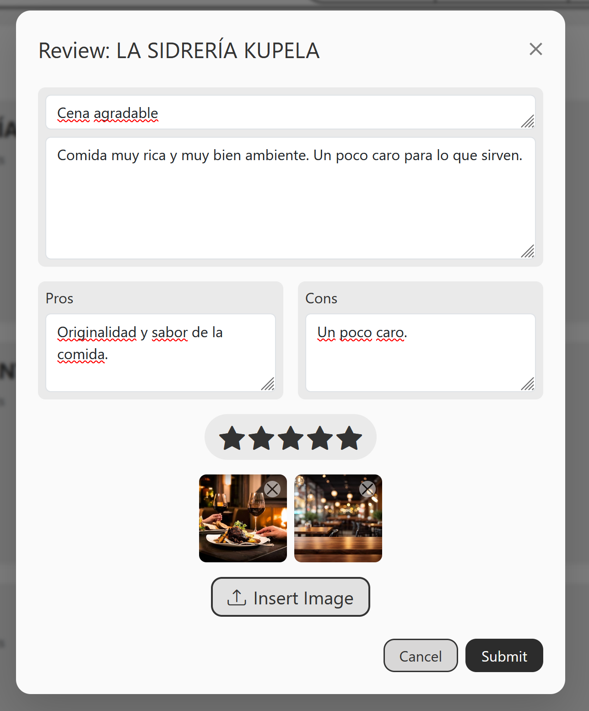      |
| **Tras insertar la imagen** | 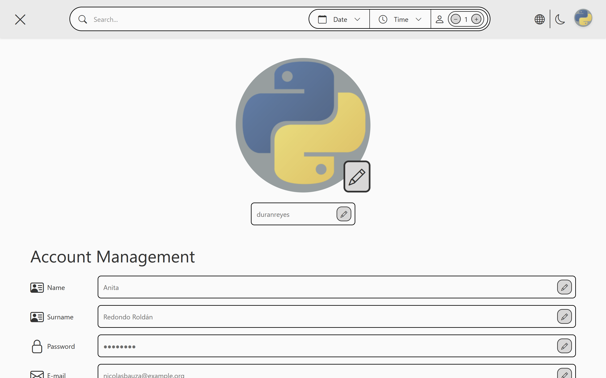 | 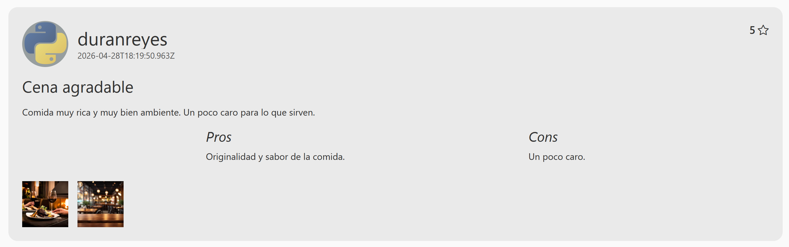 |


> [!WARNING]
> Esta funcionalidad estaba diseñada, en un principio, para utilizar el _Cloud Storage_ proporcionado
> por Firebase. No obstante, dados los cambios en los planes ofrecidos por esta aplicación, se ha optado por utilizar
> otro _Object Storage_: **Cloudinary**. Para ello, se ha creado un nuevo servicio,
> en [`cloudinary.service.ts`](bookeat/src/app/services/cloudinary.service.ts), que gestiona la
> subida de imágenes a esta plataforma.

## Tech Stack - Otros
- Se debe usar `npm install` para instalar las dependencias de la aplicación.

<br>
<div style="display: flex; justify-content: center">
    <div style="display: inline-block; padding: 10px; border-radius: 20px; ">
        <a href="https://github.com/devicons/devicon/"></a>
        <a href="https://github.com/devicons/devicon/"></a>
        <a href="https://skillicons.dev"></a>
        <a href="https://github.com/devicons/devicon/"></a>
        <a href="https://github.com/devicons/devicon/"></a>
        <a href="https://github.com/devicons/devicon/"></a>
        <a href="https://github.com/devicons/devicon/"></a>
        <a href="https://github.com/devicons/devicon/"></a>
        <a href="https://github.com/devicons/devicon/"></a>
        <a href="https://github.com/devicons/devicon/"></a>
   </div>
</div>
<br>
