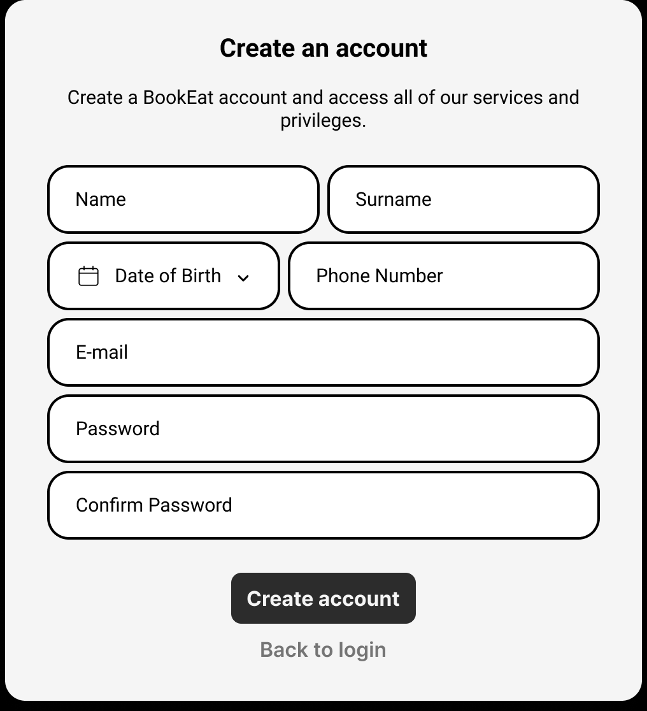
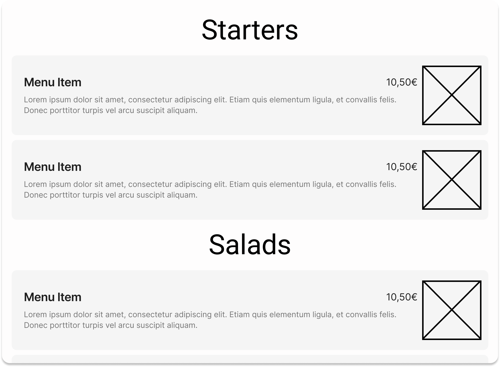
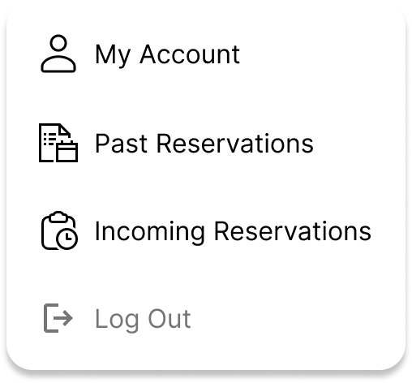
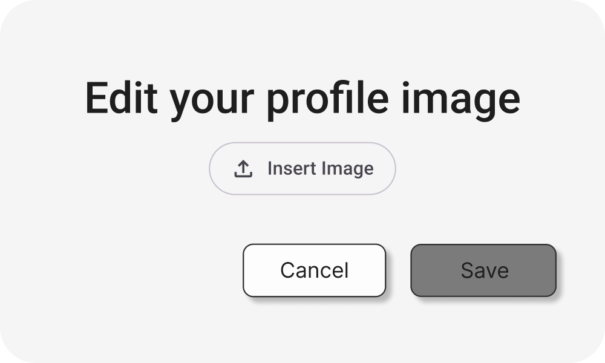
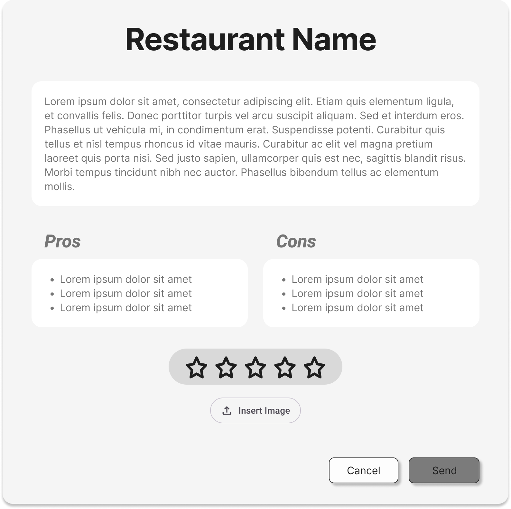
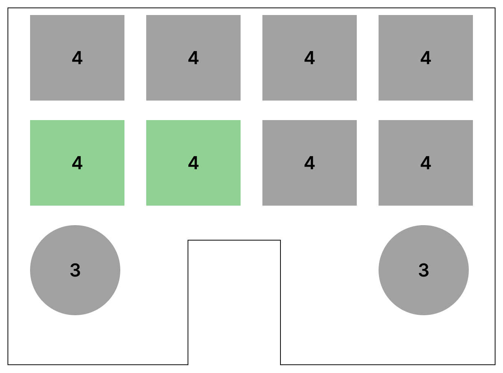

# Especificación de Popups

En esta sección se detallan todos los _popups_ que han sido desarrollados para este sitio web. Para cada uno de ellos, 
se proporciona una breve descripción así como los *templates* o páginas que los utilizan.  

---
## *Popups* de acceso público

### Inicio de sesión (_Login_)

* **Propósito:** Acceso a cuentas existentes mediante la validación de credenciales.
* **Acciones:** Envío de credenciales (`Log in`) y redirección a la creación de cuenta (`Create account`).
* **Usado en:** `Header`

### Registrar una cuenta (_Create Account_)

* **Propósito:** Recopilación de datos para la creación y alta de un nuevo perfil de usuario.
* **Acciones:** Envío de datos de registro (`Create account`) y vuelta al login (`Back to login`).
* **Usado en:** `Header`

###  Menu

* **Propósito:** Mostrar la información del menú de un establecimiento.
* **Usado en:** `Restaurant Info Page`, `Restaurant Reviews Page`

---

## *Popups* de acceso restringido

Estas ventanas únicamente se pueden mostrar en caso de que el usuario haya iniciado sesión, bien como usuario estándar,
bien como usuario restaurante.

### Mi perfil (_My Account_)

| Usuario Registrado                                  | Usuario Restaurante                                 |
|-----------------------------------------------------|-----------------------------------------------------|
|  |  |

* **Propósito:** Capa de autenticación,se utilizará para acceder a datos sensibles en cuentas de restaurante. De esta forma, únicamente los usuarios autorizados podrán acceder a modificar esos datos.
* **Acciones:** Acceso a distintas páginas personales (`Edit Profile Page`, `Reservations Page`).
* **Usado en:** `Header`

### Introducir contraseña (_Enter password_)

* **Accesible por:** Usuario restaurante
* **Propósito:** Capa de autenticación,se utilizará para acceder a datos sensibles en cuentas de restaurante. De esta forma, únicamente los usuarios autorizados podrán acceder a modificar esos datos.
* **Acciones:** Confirmación de la contraseña (`Enter`).
* **Usado en:** `Edit Profile Page`

### Editar foto de perfil (_Edit profile image_)

* **Accesible por:** Usuario registrado y usuario restaurante
* **Propósito:** Como su nombre indica, permite a los usuarios cambiar su foto de perfil.
* **Acciones:** Insertar una imagen (`Insert Image`), cancelar (`Cancel`) o guardar (`Save`) los cambios.
* **Usado en:** `Edit Profile Page`

### Confirmación de Reserva (_Booking Confirmation_)

* **Accesible por:** Usuario registrado
* **Propósito:** Confirmación de reserva completada, actuando como justificante digital.
* **Acciones:** Generación y descarga del justificante (`Download Confirmation (PDF)`).
* **Usado en:** `Book Table Page`

### Escribir reseña (_Write Review_)

* **Accesible por:** Usuario registrado
* **Propósito:** Permitir, una vez un usuario ha completado una reserva, que escriba una reseña sobre ella.
* **Acciones:** Escribir una descripción, pros y contras de la reseña, una puntuación e incluso insertar imágenes. Cancelar (`Cancel`) o enviar (`Send`) la reseña.
* **Usado en:** `Reservations Page`

### Mesas reservadas (_Booked tables_)

* **Accesible por:** Usuario restaurante
* **Propósito:** Permitir al restaurante acceder a las mesas escogidas por un cliente en una reserva en su local.
* **Usado en:** `Reservations Page`