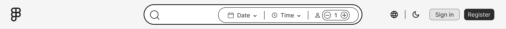
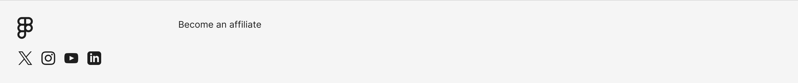

# Guía Detallada de *Templates*

## Header y Footer
Todas las páginas utilizan tanto el header como el footer

### Header

### Footer

## Inventario de *Templates*

Los templates mencionados en esta tabla se utilizan con menos frecuencia que el header y footer.

- *Nombre:* Al clicar en el nombre del template le redigirá al codigo fuente del template
- *Descripcion:* explica la función del template 
- *Usado en:* Indica en que página o template se utiliza
- *Interactivo:* 
  - ✅-> significa que tiene un código JavaScript asociado a ese template para que tenga una lógica 
  - ❌-> significa que es un template que carece de lógica individual
- *Imagen:* Al clicar en la imagen del template le redigirá al a la imagen del template para poderla ver con más detalle

| Nombre                                                        | Descripción                                                                                                                     | Usado en                                                                       | Interactivo | Imagen                                                                                                                                                                                                                                                                                                                                                                                                                                                                                                                              |
|:--------------------------------------------------------------|:--------------------------------------------------------------------------------------------------------------------------------|:-------------------------------------------------------------------------------|:-----------:|:------------------------------------------------------------------------------------------------------------------------------------------------------------------------------------------------------------------------------------------------------------------------------------------------------------------------------------------------------------------------------------------------------------------------------------------------------------------------------------------------------------------------------------|
| [**Restaurant Item**](/src/templates/restaurant-item)         | Tarjeta que resume la información de un restaurante (imagen, nombre y puntuación).                                              | `Restaurant Carousel`                                                          |      ❌      | 

                                                                                                                                                                                                                                                                                                                                                                                                |
| [**Restaurant Carousel**](/src/templates/restaurant-carousel) | Carrousel **interactivo** para navegar por colecciones de restaurantes destacados.                                              | `Landing Page`                                                                 |      ❌      | 

                                                                                                                                                                                                                                                                                                                                                                                                              |
| [**Date Selector**](/src/templates/date-selector)             | Selector de fecha para determinar el día de la reserva.                                                                         | `Header`                                                                       |      ✅      | 

                                                                                                                                                                                                                                                                                                                                                                                                    |
| [**Hour Selector**](/src/templates/hour-selector)             | Selector de franja horaria **interactivo y personalizado** para una reserva.                                                    | `Header`                                                                       |      ✅      | 

                                                                                                                                                                                                                                                                                                                                                                                                    |
| [**Hour Button**](/src/templates/hour-button)                 | Botón individual que representa una franja horaria específica y su estado (libre/reservada).                                    | `Hour Selector`, `Hour Table`                                                  |      ❌      | 

                                                                                                                                                                                                                                                                                                                                                                                                        |
| [**Diner Selector**](/src/templates/diner-selector)           | Selector **interactivo y personalizado** para el número de comensales que asistirán a la reserva.                               | `Header`                                                                       |      ✅      | 

                                                                                                                                                                                                                                                                                                                                                                                                |
| [**Range Date Selector**](/src/templates/range-selector)      | Selector de rango de fechas para filtrar reservas o eventos dentro de un rango de fechas (inicio y fin).                        | `Reservations Page`                                                            |      ✅      | 

                                                                                                                                                                                                                                                                                                                                                                                        |
| [**Restaurant Info**](/src/templates/restaurant-info)         | Bloque de contenido con la descripción detallada, servicios y datos de contacto del restaurante.                                | `Restaurant Page`, `Restaurant Reviews Page`                                   |      ❌      | 

                                                                                                                                                                                                                                                                                                                                                                                                |
| [**User Score**](/src/templates/user-score)                   | Indicador de la calificación otorgada por los usuarios al restaurante.                                                          | `Restaurant Item`, `Restaurant Info`, `User Review`, `Restaurant Reviews Page` |      ❌      | 

                                                                                                                                                                                                                                                                                                                                                                                                           |
| [**Menu Item**](/src/templates/menu-item)                     | Ficha de producto para la carta, incluyendo nombre del plato, descripción y precio.                                             | `Menu Section`                                                                 |      ❌      | 

                                                                                                                                                                                                                                                                                                                                                                                                            |
| [**Menu Section**](/src/templates/menu-section)               | Contenedor que agrupa una categoría de platos.                                                                                  | `Menu Popup`                                                                   |      ❌      | 

                                                                                                                                                                                                                                                                                                                                                                                                      |
| [**User Review**](/src/templates/user-review)                 | Reseña de un usuario, muestra información como la descripción, la valoración o los pros y contras.                              | `Restaurant Page`, `Restaurant Reviews Page`                                   |      ❌      | 

                                                                                                                                                                                                                                                                                                                                                                                                        |
| [**Star Selector**](/src/templates/star-selector)             | Selector de estrellas **interactivo** para puntuar a un restaurante.                                                            | `Write a Review Popup`                                                         |      ✅      | 

                                                                                                                                                                                                                                                                                                                                                                                                    |
| [**Overview**](/src/templates/overview)                       | Registro **dinámico** de información de restaurantes o reservas, adaptado según su uso.                                         | `Searcher Page`, `Reservations Page`                                           |      ❌      | 
<a href="/doc/images/templates/overview/overview-1.png"><a href="/doc/images/templates/overview/overview-3.png"><a href="/doc/images/templates/overview/overview-4.png">
 |
| [**Table Map**](/src/templates/table-map)                     | Mapa **interactivo** del local para la selección de mesas sobre el plano.                                                       | `Book Table Page`                                                              |      ✅      | 

                                                                                                                                                                                                                                                                                                                                                                                                            |
| [**Edit Button**](/src/templates/edit-button)                 | Botón de acción para activar la edición de campos en el perfil.                                                                 | `Edit Property`, `Modify Profile Page`                                         |      ❌      | 

                                                                                                                                                                                                                                                                                                                                                                                                         |
| [**Edit Property**](/src/templates/edit-property)             | Campo para modificar datos específicos del usuario o restaurante.                                                               | `Modify Profile Page`                                                          |      ❌      | 

                                                                                                                                                                                                                                                                                                                                                                                                      |
| [**Insert Image**](/src/templates/insert-image)               | Botón de carga de archivos para subir imágenes.                                                                                 | `Edit Profile Image Popup`, `Write Review Popup`                               |      ✅      | 

                                                                                                                                                                                                                                                                                                                                                                                                      |
| [**Hour Table**](/src/templates/hour-table)                   | Cuadrícula organizada que contiene todos los `Hour Button` disponibles para un restaurante en una franja de tiempo determinada. | `Book Table Page`                                                              |      ✅      | 

                                                                                                                                                                                                                                                                                                                                                                                                          |